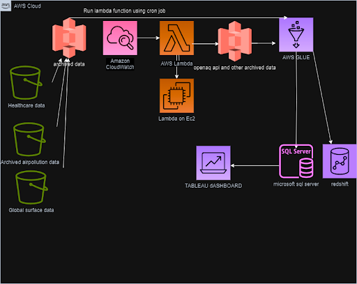
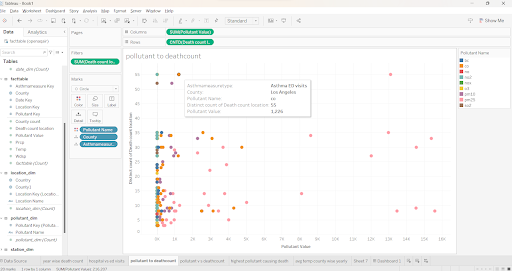
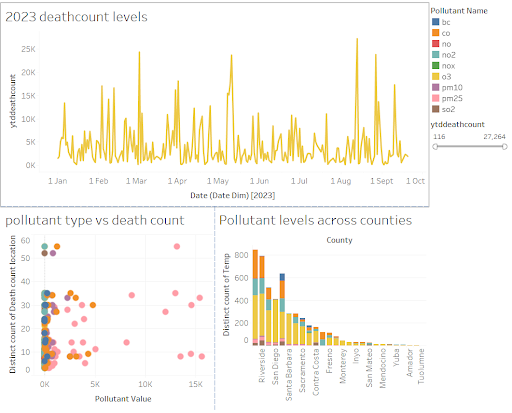

# Air Quality Data warehouse and analysis using Busineass Intelligence

## Title: Air Quality Data Warehouse and Business Intelligence on public health

## 1: Project Overview
The primary objective of our Air Quality Data Warehouse for Exploring Impact on Public Health is to analyze air quality data from various sources, including OpenAQ, Healthcare, and Global Surface Temperature data, along with real-time API inputs. The focus is on understanding environmental factors contributing to asthma issues in California, with broad applications across healthcare, insurance, medical practitioners, and research teams.

Addressing the complexities of air quality monitoring, our project employs advanced data engineering and analytics techniques. The overarching goal is to craft a comprehensive solution that efficiently collects, processes, analyzes, and visualizes real-time air quality data. By achieving this, our aim is to empower stakeholders by providing accessible data in the data warehouse, facilitating its utilization for deriving valuable insights. Leveraging two additional datasets—Healthcare and air quality, GSOD data—our project addresses challenges associated with air quality monitoring and its profound impact on various domains

## 2. Methodology: 
Our methodology is underpinned by a robust and scalable architecture designed to seamlessly integrate data from diverse sources and ensure its quality and accessibility. This architectural diagram visually represents the key components and their interactions within our data pipeline. 
Architecture Overview:

## 3: Tableau Visualizations:
Summary of Tableau analysis:
● The analysis identifies the top 5 pollutants as the primary contributors to asthma-related fatalities in California pm2.5 seems to be the top pollutant for deaths.Pm2.5 emerges as a major pollutant affecting lungs, despite higher overall O3 values in certain counties.

●	Los Angeles emerges as the leading county for Asthma Emergency Department (ED) visits, followed by Riverside, Orange, Alameda, Fresno, etc.

●	O3 and Co pollutants are identified as the key contributors to the rise in temperature levels.A notable trend is observed with increased pollutant levels during the first week of every month.

Keywords -- Data, processing, AWS,  Real time air api,ETL -Glue,Healthcare,tableau,Ssms.

